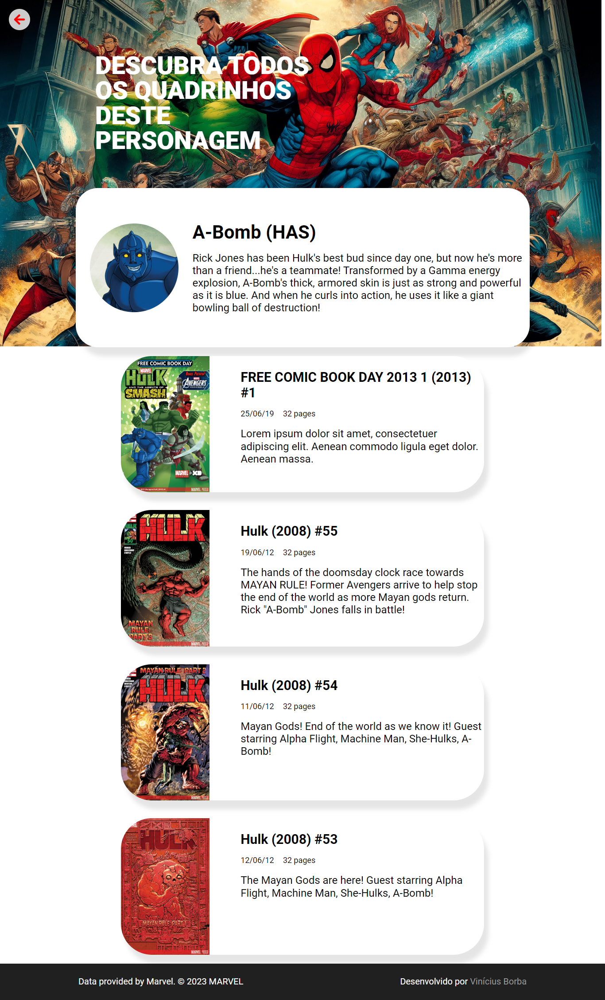
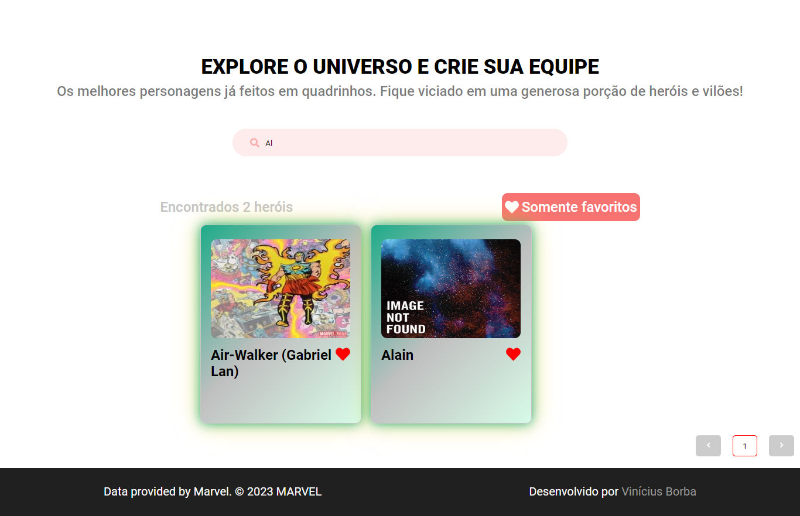
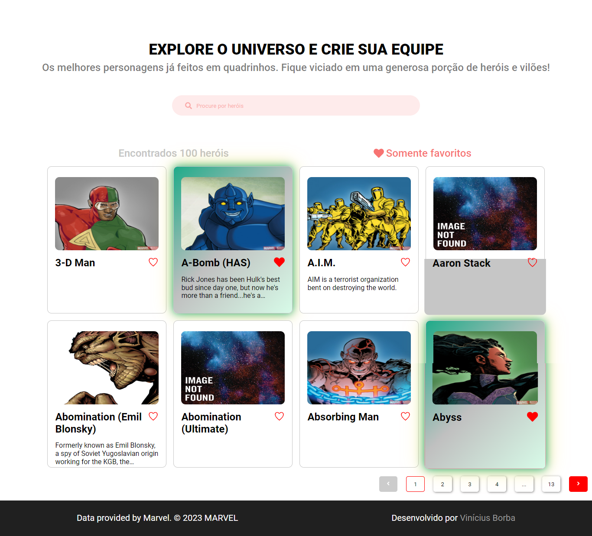

# My Heroes

My Heroes é uma Single Page Application (SPA) desenvolvida com React que consome a API da Marvel para exibir uma lista de heróis. Os usuários podem ver detalhes sobre cada herói e salvar seus favoritos, que são armazenados de forma persistente.

## Tecnologias Utilizadas

- React: Biblioteca principal para construção da interface do usuário.
- Redux: Gerenciamento de estado global para controlar dados de heróis e favoritos.
- Redux Persist: Persistência dos dados favoritos no armazenamento local.
- Styled Components: Estilização dos componentes com CSS-in-JS.
- Axios: Cliente HTTP para fazer requisições à API da Marvel.
- React Router DOM: Gerenciamento de rotas para navegação SPA.
- TypeScript: Tipagem estática para maior segurança e qualidade do código.

## Funcionalidades

- Listagem de heróis da Marvel com paginação.
<div align="center">

</div>
- Exibição de detalhes de cada herói, incluindo nome, descrição e quadrinhos relacionados.
<div align="center">


</div>

- Possibilidade de adicionar e remover heróis dos favoritos.
<div align="center">


</div>

- Persistência dos favoritos, mesmo após o fechamento da aplicação.
<div align="center">


</div>

## Pré-requisitos

Para rodar o projeto localmente, você precisará ter o Node.js e npm (ou yarn) instalados.

Além disso, é necessário obter uma chave de API da Marvel:

1. Cadastre-se no portal da [Marvel](https://developer.marvel.com).
2. Crie uma chave de API e salve-a para configuração no projeto.
3. Configure sua chave da API Marvel:

- Crie um arquivo .env na raiz do projeto e adicione sua chave de API da Marvel:

```bash
  VITE_PUBLIC_KEY=YOUR_PUBLIC_MARVEL_API_KEY
  VITE_PRIVATE_KEY=YOUR_PRIVATE_MARVEL_API_KEY
```

## Rodando localmente

Clone o projeto

```bash
  git clone https://github.com/viniciusbq/My-Heroes
```

Entre no diretório do projeto

```bash
  cd my-heroes
```

Instale as dependências

```bash
  npm install
```

Inicie o servidor

```bash
  npm run dev
```

## Contribuição

Contribuições são bem-vindas! Se quiser melhorar o projeto, siga estes passos:

Faça um fork do projeto.
Crie uma branch para sua funcionalidade: git checkout -b feature/sua-funcionalidade.
Commit suas mudanças: git commit -m 'Minha nova funcionalidade'.
Envie para a branch principal: git push origin feature/sua-funcionalidade.
Abra um Pull Request.

## Licença

Contribuições são bem-vindas! Se quiser melhorar o projeto, siga estes passos:

Este projeto é distribuído sob a licença MIT. Consulte o arquivo LICENSE para mais detalhes.
